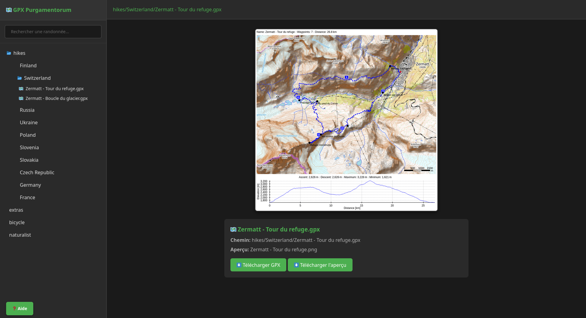
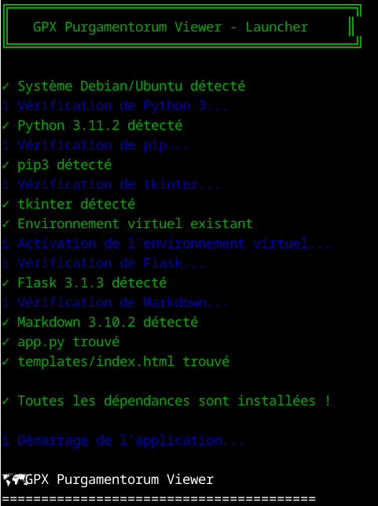

# 🗺️ GPX Purgamentorum Viewer

Easily view and navigate your hiking GPX files with automatic map previews.

## 📸 Preview

**Main Interface:**



**Generation Prompt:**



## ✨ Features

- **Tree Navigation**: Intuitively browse your folders and GPX files.
- **Automatic Preview**: Displays the PNG maps associated with each hike.
- **Quick Search**: Instantly find a hike by its name.
- **Download**: Easily retrieve your GPX files and their maps.
- **README Viewer**: Access the repository documentation in one click.
- **Modern Interface**: Clean, dark, and ergonomic design.

## ✨ Softwares

- **GPXSee**: Create your png preview files. (https://www.gpxsee.org/)
- **GPX Studio**: Make your own GPX files. (https://gpx.studio/)

## 📦 Installation

### Prerequisites

- **Debian/Ubuntu** (or any Debian-based distribution)
- **Python 3** (version 3.6 or higher)

### Quick Installation

1. **Clone the repository** (if not already done):
```bash
git clone https://github.com/MDitor-map/GPX-purgamentorum.git
cd GPX-purgamentorum
